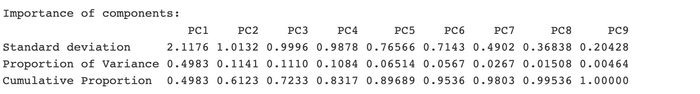

```{r setup, include=FALSE}
knitr::opts_chunk$set(echo = TRUE)
```

# Explore Loan Aprroval Data with Machine Learning(ML) in R

## Section One - Can I get a loan approval?

As an new coming international student, you may have heard the credit scores. But what will it influence? It is usually one of factors used by financial institutions to determine if someone can get the loan, mortgage or the credit card.

In Finance Academia, a series of research focus on bank side -- how to detect the loan default. For instance, their models may identify persons whose default risk are 10% above, and discuss the traits of default risk. But these sample are people who already get loan. Before that, how do I know whether I can get the loan? (our perspective is different from them and the problem set at class.)

It may be related to chances of repay. We can apply ML method to form a model. For banks, loan decision ML model might save their time. Further, they may reconsider heightening the criteria if the model doesn't meet their expectations based on auditing outcomes of the model's automatic predictions. As customer, it would also be helpful for their own evaluations. In my home city, there is no tool to do "pre-check"(without hard check the credit background). So, we are curious about **finding a model that can predict loan approval decisions**. We would like to predict the likelihood of a customer getting loan approval based on the given features. Our target is to let loan decision model conduct as consistent as a real human-being does. That is we want our model's prediction as good as human's judgement.

(We don't expect the model can predict better than banks-experts since we feed the data from banks' judgements. Also, for banks, this model is just to imitate how banks past decisions "have been made" so as to think over what they now do to check if their standards need to be heightened, relaxed or consistent.)

### Dataset and Potential Goals for our models

This dataset can be found at [Kaggle](https://www.kaggle.com/datasets/architsharma01/loan-approval-prediction-dataset) uploaded by Archit Sharma. Since it doesn't mention the source and also financial records are sensitive, we temporarily treat them as simulated data (But just do our task and think over the situations as if we are handling the real one). Based on features, most of them can be accessed from both banks and customers. So, as we said above, our study's goal is to make the accuracy higher. For our potential users, customers want the model's predictions of approval is really the bank's approval at the end; banks want the predictions of approval was the banks real aprroval made in the past. So, we will use **accuracy** (correct estimates/all estimates) and **precision** (true approval/all estimated approval) to evaluate our model in this study.

Also, we include kappa to correct the guessing from imbalanced dataset. Consider a naive model that predicts every loan application as "approved." In this dataset, this model would achieve an accuracy of 62% without genuinely capturing the intricacies of the data (If model just give "Approved" predictions, they can still "correctly" predict 62% across the dataset ). This illustrates how accuracy can be artificially inflated in imbalanced datasets.

### Data Dictionary

| Target and Feature Name      | Explanation                                                                 |
|--------------------------|----------------------------------------------|
| **loan_id**                  | A unique identifier for each loan application.                              |
| **no_of_dependents**         | Number of dependents of the applicant.                                      |
| **education**                | Education level of the applicant (e.g., Graduate, Not Graduate)             |
| **self_employed**            | Whether the applicant is self-employed (Yes/No).                            |
| **income_annum**             | Annual income of the applicant.                                             |
| **loan_amount**              | The amount of loan requested by the applicant.                              |
| **loan_term**                | Term duration for the loan in years.                                        |
| **cibil_score**              | CIBIL score of the applicant (a measure of creditworthiness). Credit Score. |
| **residential_assets_value** | Value of the applicant's residential assets.                                |
| **commercial_assets_value**  | Value of the applicant's commercial assets.                                 |
| **luxury_assets_value**      | Value of the applicant's luxury assets.                                     |
| **bank_asset_value**         | Value of the applicant's assets held in banks.                              |
| **loan_status**              | Whether the loan was approved or rejected.                                  |

: Loan Decision Data

We are not here trying to know if these features are enough and smart. While, we want our ML model run well under these features\~ Let's assume our dataset is from reliable sources. (Though the quality of dataset is still a concern in Machine Learning World.)

## Feature selection and exploration

We want to pick up most relevant features to make a prediction. This pre-selection using relevant analysis and our human professional may tease out some part of noise. (Unrelated datapoint will be learnt by ML Method (**overfitting**), which will result in unreliable prediction when comes to new dataset.)


Our **target column (TC)** is **loan_status**. Others are features. If features are strongly correlated to TC. We may keep them. After that, we draw the correlation plot to see relation between features. Strong relation may indicate the feature is good for dimensional reduction (Hold on here, do we really need dimensional reduction in every case or in this case? We should be cautious). **Higher dimensions** represent more features, which may:

1.  need more sources to compute (complexity);
2.  learn the noise as we discuss (overfitting);
3.  As the number of dimensions (features) grows, the amount of data we need to generalize accurately grows exponentially. Then model performance reduced.

(Let's say we cut line with 10 units, we need 10 to cover the length; Then think of a square with 10 units side, we need 10\^2 to cover; ... 10 dimensions will be 10\^10, that make datapoints sparse! )


### Non-information feature

We first remove ***load_id***. The nature of load_id is just an incremental number without any information such as branch code. It doesn't have predictive influence. If our ML is made to learn that, it would become the noise.

### Features Importance from correlation plot

Since for customers and banks, accurate prediction is their first demand. The scenario is focused on giving more correct aprroved or rejected predictions used by fixed features (around 11 features) input, so at this stage, our bias-variance trade-off comes: how to learn important information and tease out unimportant noise as much as possible simultaneously? (For loan approval prediction, frankly to say, 12 features are usually not enough. But what if we only have access to these features?). From correlation plot, we could see **credit score(cibil_score) has strongest relation** to the loan approval decision. **But credit score may absorb the other feature's power**. **Some numeric features of assets and income are correlated to each other**. These may result in multi-linearity concern, which influence our choice of ML algorithm below.


After looking all features we have, we assume **credit score, assest value/income and loan itself property** (term,amount,etc.) may be the **three main traits that jointly decide the loan approval**. We expect to see the importance of credit score feature and will do Principal Component Analysis (PCA) to further interpret relevant importance of features. Possibly, we may compress numeric features and use components to explain (to our model users) what ML model reviewing.

### Normalization before PCA

Since numeric features' scale is different, we would like to normailize it.The reason is:

1.  Algorithms that use distance metrics like k-nearest neighbors(KNN) perform better when features are put in a same scale. Otherwise, features with larger scales will disproportionately influence the distance computations.

2.  When we compare the importance or coefficients of features, same scale allows for a more direct comparison.

3.  Large scale features will be given more variance, which will led them to load on the PC1.

### PCA analysis--find out the interpretation of our features

When evaluating loan applications, it's essential to consider a holistic view of potential borrowers. Principal Component Analysis (PCA) allows us to compress multiple features into fewer dimensions, making patterns and relationships more discernible. Based on our examination, we've determined three principal components to encapsulate the key dimensions of our dataset:

**Creditworthiness Profile**: Represented by the **'Credit Score'**, this dimension captures a customer's financial behavior and their standing in the community. A person's credit score is more than just a numerical value; it's an indicator of their financial responsibility and past behavior, reflecting the reliability and potential risks associated with loan repayment.

**Financial Stability**: This is gauged through **'Assets' and 'Income'**. Together, they provide a snapshot of a borrower's financial health. In the event of a default, a borrower's assets and income play a pivotal role in determining the feasibility of legal recourse. This dimension essentially weighs the tangible security a borrower brings to the table.

**Loan Commitment**: Defined by **'Term' and 'Amount'**, this dimension gives us an insight into the borrower's intent and the potential risk for the lender. The size of the loan and its duration can reflect a borrower's confidence in their ability to repay and the lender's exposure to risk.

In essence, these dimensions answer two fundamental questions: **"How trustworthy is this individual in a financial context?"** and **"In the event of unforeseen circumstances, what is our potential exposure and the borrower's capability to resolve it?"**

To find out if **3** is the optimal number of principal components to retain is a crucial step in PCA. So, we consider these methods:

**Eigenvalues Greater Than One Rule**: This rule suggests retaining all components with eigenvalues greater than one. The rationale is that a component should explain more variance than a single original variable.

**Our plot indicate 2-4 may be the optimal number**

**Scree Plot Turning Point**: This method plot the eigenvalues in descending order. Then, look for the "elbow" of the curve, where the eigenvalues start leveling off. This "elbow" often indicates the optimal number of components. Components to the left of the elbow retain most of the information, while those to the right add little value.

**The turning point in our case is 2.**


Considering these two methods, there's a consensus that at least 2 components are necessary.(2-4 are suggested)

Our preference for 3 principal components isn't merely based on these methods but also on the interpretability of the components. By associating PC1, PC2, and PC3 with "Financial Stability", "Loan Commitment" and "Creditworthiness Profile", respectively, we try to achieve a coherent and intuitive understanding of the dataset's features. Furthermore, these first three components capture a significant 72.33% of the dataset's variance (while using accumulated variance view, maybe 6 is more reliable number since it covers 95.36% variance), striking a balance between simplification and information retention. (Our goal is to predict better in the given features, so let's explore with and without PCA processing in the following part.)

](PCA_feature_included.png)

## Model Choice

In correlation plot, we find some features are correlated with each other. Also, the credit score might also reflect some part of other features. Someone will think we can simply drop some features to get the real evaluation. But we may not arbitrarily discarding the meanless-like ones. The reason is that our task is to use these features as inputs to give recommendation (predictions) for borrowers. Drop features manually will lose some information and is hard to interpret. We can choose algorithm that relieve multicollinearity concerns instead of simply dropping some of features.

So, in our study, we picked **Lasso regression and Random Forest** as our main methods to predict loan decisions, and here's why:

Our dataset had features that are correlated with each other, some of which might not be that important. Lasso regression is great for this because it can automatically give less importance or even completely ignore features that don't help much in prediction. This makes our model simpler and more focused. Our logic to choose Lasso:

We want to use penalty L1 from Lasso to set less importance feature's coefficient as 0. This will let the model more interpretable. Ridge Method will just adjust the coefficient, it doesn't own the function of variable selection (filter) like Lasso.

We can see the following figure: convex object is coefficient estimates with same error. When finding the tagent point, the penalty term From Lasso has sharp point. Convex objects will have more chance to touch the corner points, which set coefficient to zero. But Ridge penalty term are the sphere, its edge is differentiable. It's not easy to set a feature's coefficient as zero.


As Lasso's penalty is more strict than Ridge, it will lead to "absolute shrinkage" (Tibshirani, 1996), i.e. easy to wipe out features. So, we should take it into consideration when explaining the outcome.

On the other hand, Random Forest is a powerhouse when it comes to handling complex data. It can work with data that isn't perfectly clean or has features that are related to each other. You may be curious how does it work? Imagine standing at the edge of a dense forest. This forest comprises numerous trees, each distinct in its shape, size, and characteristics. Now, suppose you're holding an apple and you want to determine its variety. To find out, you decide to consult each tree in the forest.

You approach the first tree, describe your apple, and the tree "tells" you its opinion on the apple's variety. You continue this process, consulting the entire forest and seeking opinions from every tree. At the end, you sum up the answers from all the trees, and the variety that's pointed out by the majority becomes your final answer.

In this analogy: Each tree represents a decision tree in the Random Forest algorithm and the entire forest symbolizes the Random Forest model. Each tree is trained on a slightly different subset of data and, during its construction, randomness is introduced in selecting the features for splitting. When making a prediction for a new data point, each tree in the forest provides its prediction. In the end, the most common prediction among all trees is chosen as the final outcome.


So, Random Forest is just like a committee where each member (decision tree) offers its insights to solve a problem. The group then collect these suggestions to make a collective decision. This ensemble approach often allows Random Forest to outperform individual decision trees in many situations.(Every tree may compensate other trees weakness.)

As said above, it builds multiple small decision trees and combines their outcomes for a final result. This means it's less likely to miss out on important patterns in the data. Every small tree just uses part of features, which alleviate our concern about multicollinearity. The variables of each tree are selected randomly.

## Whether use PCA in data preprocessing

We tested these algorithms in two ways: one using PCA, to further simplify our data's dimensions, and another without PCA. In the end, we found that the models without PCA run better. While PCA is useful, in our case, the goal of accuracy made us prefer keeping the original features as it was gave us better results. (If we do both PCA and Lasso/Random Forest, it is equal to filter and compress information from features for **two times**. It will be underfitting in some way.)

## Parameter, Tuning, Outcome Performance Metric

### Lasso Model

For Lasso, we set parameter "mixture" as 1 to run the Lasso model. If we set it as 0, it is Ridge. If we want to introduce both L1 and L2 penalty from Ridge and Lasso, we can set it between 0 and 1. This is the "stand in the middle" option. Then, we are tuning the penalty lamda to find in what degree we will shrink. High lamda increases the regularization strength, which can lead to underfitting (high bias and low variance). Low lamda makes the model potentially fit the noise in the data and lead to overfitting (low bias and high variance). **The best Lasso's lamda is found at 0.03 (with PCA) and 0.015 (without PCA).**

### Tuning concern found in Lasso Model in the case

To make sure we get the higher performance, we also change the parameter configurations. Setting mixture to 0, we see Ridge's performance is lower than Lasso's (Accuracy 91.6% vs 93.1%). We also add mixture into the tuning grid (mixture=tune()), but still find a weaker performance (Accuracy = 92.7%) which doesn't make sense. If mixture = 1 is the best, our searching from 0 to 1 should have same result as mixture = 1 (Lasso Model). So, perhaps the algorithm of searching grid isn't perfect enough.

Then, we try the bayes tuning grid. But it shows no improvement, returning us current result. Since Random Forest performance is better, we'd like to keep the Lasso (mixture = 1)'s result.

### Random Forest Model

For Random Forest, Probst et al. (2019) find it has little variation than other algorithms when tuning parameters. It is more robust. We set the number of tree as 1000 to ensure the stability of our predictions. This algorithm has several parameters that control its behavior and performance. In R package, two important ones are mtry and node size (often called min_n). Here's a breakdown of what these parameters mean:

**mtry**

1.  What it is: The mtry parameter specifies the number of features to consider when looking for the best split at each tree node.

2.  How to understand it: Imagine you're constructing a decision tree and arrive at a particular node. Normally, you'd consider all features to find the best one to split on. But in a Random Forest, you randomly select mtry features and only consider these for the split.

3.  Impact:

High mtry: If mtry is equal to the total number of features, the Random Forest will behave like a bagging ensemble of deep trees. Low mtry: If mtry is low, the trees in the forest will be more dissimilar, providing a more diverse ensemble. This usually helps to reduce overfitting but could increase bias if set too low.

**node size (or min_n)**

1.  What it is: This parameter specifies the minimum number of samples required to make a split at a node.

2.  How to understand it: If you're at a node with fewer samples than node size, you don't split it further and make it a leaf node.

3.  Impact:

High node size: Setting a high node size will make the trees shallower and may result in a more biased model. We called this "stopping early" strategy. This could be beneficial if you're dealing with overfitting. Low node size: A low node size will allow the trees to grow deeper, capturing more complex patterns in the data. However, this could lead to overfitting if set too low.

After tuning these two, we find out **the best Random Forest model's mtry and min_n is (1,11) with PCA/ (7,11) without PCA**. As our goals and the nature of imbalanced dataset discussed in Dataset part above, our question is:**"Out of all the 'approved' predictions, how many were actually correct?"** So, accuracy, kappa, and precision are chosen for the performance metric.

Using the test set with best models, we find **Model without PCA better**. **Random Forest model run better than Lasso model.** Here's the outcome:


The **Random Forest Model without PCA has the highest accuracy and precision at 98.1% and 98.6% respectively.** Also, it has short gap between accuracy and kappa (0.981-0.960 = 0.021). But, the importance plot generated by the Random Forest Model shows that credit score seems to donminate the loan decision. If that is the case, this feature's credibility may be the focal point for both borrowers and lenders.

## Why PCA doesn't work well as expected?

As discussed, PCA will compress the information. In our study, PCA was initially deployed to identify linear combinations of features that capture the most variance, starting with the first principal component and then, under orthogonality constraints, sequentially finding the feature linear combination with maximum variance for the second principal component, and so on. This was particularly driven by our interest in the high correlation observed between assets and income. The goal was to use PCA not just for dimensionality reduction, but also to enhance the model's interpretability, balancing between predictability and interpretability. That's why we consider number 3 is suitable.

However, we encountered limitations. Using only three principal components didn't capture sufficient variance, a metric often recommended to exceed 90% for effective application of PCA. Upon increasing the number of components to six, the model's performance came closer to what we observed without PCA.

Therefore, the role of PCA in this study appears to be more focused on correlational analysis and model interpretability rather than feature selection or predictive performance enhancement. Given the improved performance with six components, we conclude that PCA's utility in this study is mainly to deepen our understanding of feature relationships, rather than to serve as a tool for variable selection.


## Random Forest run better than Lasso?

While both methods aim to deal with collinearity in this case, Random Forest does so without sacrificing as much feature information as Lasso. This likely accounts for Random Forest's superior performance in our study.

Lasso works by applying a penalty term to the regression equation, reducing some feature coefficients to zero. In doing so, Lasso essentially "discards" these features from the model, resulting in a simpler but less informative model. This feature elimination can lead to a loss of potentially useful information, which may in turn affect the model's predictive accuracy.

Random Forest, on the other hand, takes a more inclusive approach. It builds multiple decision trees during training and outputs the mode (for classification) prediction of the individual trees for unseen data. This ensemble method inherently handles collinearity by considering all features but in randomized subsets, thereby retaining more information than Lasso.

## How much is the cost that small bias incurred?

In our study, the focus is on aiding borrowers in pre-assessing the likely outcomes of their loan applications. Even though there are no direct financial gains or losses involved in this pre-assessment, there are potential costs associated with even a slight bias in our model predictions.

For instance, consider a small bias leading to false-positive----borrowers who do not meet the loan criteria but are indicated as "approved" by our model. In this case, the borrower stands to lose out on future chances of getting the loan by using the bank's hard check and their expectations are ruined. Simultaneously, the bank would spend additional time to check a case that should be rejected.

Given these potential costs, we have chosen to focus on Accuracy and Precision as key performance metrics for our model. This helps to minimize the situation, thereby reducing the potential losses for both borrowers and the bank. Therefore, even a small bias in our model holds substantial implications, making it crucial to aim for as unbiased a model as possible.

## Practical concerns in this problem and dataset

1.  Data Granularity and Accuracy: The data in our current dataset may not be finely tuned to individual circumstances, leading to potential misjudgments. For instance, the income field might only reflect basic salaries, overlooking bonuses distributed through other means. Similarly, property ownership does not necessarily correlate with an individual's financial standing. This is particularly true for international students who typically don't own property in studying area and may find it challenging to secure loans based on this model. A more nuanced approach would be to incorporate granular data such as mobile phone call records, frequent locations visited, frequency of online transactions (metadata in personal devices), the weight in each type of the investment within the portfolio (bond, fund, stock, option,...) and so on. This would offer a more accurate representation of an individual's financial status (Blumenstock et al., 2015) compared to loosely related variables like property valuation (High frequency of individual behavioural data are called). Nevertheless, how to exploit these data and annonate these data should be a headache. 

2.  Privacy and Legal Concerns: The model must be designed with due consideration for privacy laws and regulations. Inclusion of granular data may bring about privacy concerns that need to be addressed legally.

3.  Dataset Representativeness: The diversity, availability, and representativeness of the data influence the model's ability to generalize across different markets. Each region has its unique features, like school district-related property values or Singapore's HDB public flat, which could be of significant local importance but less so elsewhere.

Challenges in Cross-Market Generalisation: As a result, even if the data is standardized, the market conditions, cultural differences, and valuation metrics vary from market to market. Certain data may be inaccessible in some markets, like the value of public housing. Additionally, privacy concerns may deter individuals from entering their property values into the tool. Lacking localized features in the data is akin to training a meat recognition model only on beefsteak, eye of round, and ham, while neglecting other types like white pork ribs or Singaporean Bak Kut Teh. Such limitations could restrict user applicability and require legal oversight (Buolamwini and Gebru, 2018). This also raises questions about the model's performance on other datasets.

In summary, to achieve a universally applicable model, we need to address data granularity, comply with privacy laws, and consider the unique attributes of different regions. Failing to do so could not only limit the model's utility but also pose legal risks and performance evaluation issues with other datasets. 

## Brief discuss data acquiring and labeling issue
However, we often face difficulties in acquiring broad and representatie data, especially more granular ones. Like site visits, this information is proprietary, even if we want to use user's frequent location in Map App, it is not easy. Hard to access, difficult to mask data...these things need to be tackled for a better quality dataset. Further, manually annotated approal data is generated by banks. If banks would like to improve their efficiency (like reducing labor and time cost) by AI model instead of having the model just imitated themselves, self-supervised learning is the direction our their research. They can self extract information from massive unlabel data, learning their own structures and rules. Then, it generated proxy label automatically (like user portrait/financial stability) without human intervention (LeCun, 2020; Misra et al., 2020; Zbontar et al., 2021; Balestriero et al., 2023). This pretext can be used to fine-tune our final loan decision model subsequently (with small labelled data that includes approved or rejected), which has the potential to significantly ease the bottleneck caused by the reliance on manually-labeled data.

## Reference

Balestriero, R., Ibrahim, M., Sobal, V., Morcos, A., Shekhar, S., Goldstein, T., ... & Goldblum, M. (2023). A cookbook of self-supervised learning. arXiv preprint arXiv:2304.12210.

Blumenstock, J., Cadamuro, G., & On, R. (2015). Predicting poverty and wealth from mobile phone metadata. Science, 350(6264), 1073-1076.

Buolamwini, J., & Gebru, T. (2018). Gender shades: Intersectional accuracy disparities in commercial gender classification. In Conference on fairness, accountability and transparency (pp. 77-91). PMLR.

LeCun, Y. (2020, February). Self-supervised learning. In Proceedings of the Thirty-Fourth AAAI Conference on Artificial Intelligence, AAAI, Invited Talk.

Misra, I., & Maaten, L. V. D. (2020). Self-supervised learning of pretext-invariant representations. In Proceedings of the IEEE/CVF conference on computer vision and pattern recognition (pp. 6707-6717)

Probst, P., Boulesteix, A. L., & Bischl, B. (2019). Tunability: Importance of hyperparameters of machine learning algorithms. The Journal of Machine Learning Research, 20(1), 1934-1965.

Tibshirani, R. (1996). Regression shrinkage and selection via the lasso. Journal of the Royal Statistical Society Series B: Statistical Methodology, 58(1), 267-288.

Zbontar, J., Jing, L., Misra, I., LeCun, Y., & Deny, S. (2021, July). Barlow twins: Self-supervised learning via redundancy reduction. In International Conference on Machine Learning (pp. 12310-12320). PMLR.

## Section Two - Code

Attached is the code to run if you'd like to, thanks.

```{r  message=FALSE, warning=FALSE}
library(readr) #preset package
library(tidymodels)
library(tidyverse)
library(corrplot)
library(bestNormalize)
library(ggforce)
library(patchwork)
library(baguette)
library(discrim)
library(learntidymodels)
library(embed)
library(plotly)
library(vip)
#install.packages("ranger")
library(ranger)
library(yardstick)
#install.packages("gt")
library(gt)
#install.packages("dials")
library(dials)
#install.packages("tune")
library(tune)
options(width=100)
```

```{r}
loan_approval_dataset <- read_csv("loan_approval_dataset.csv",show_col_types = FALSE) #load csv dataset
```

```{r}
char_columns <- sapply(loan_approval_dataset, is.character) #sort out our character features
loan_approval_dataset[char_columns] <- lapply(loan_approval_dataset[char_columns], as.factor) #change these into factor
head(loan_approval_dataset) #check our dataset structure
```

```{r}
#Prepare training and test data
set.seed(2027931)
loan_split <- initial_split(loan_approval_dataset[, !(names(loan_approval_dataset) %in% c("loan_id"))], strata=loan_status, prop=7/10) #split and delete load_id column
loan_train <- training(loan_split)
loan_test   <- testing(loan_split)
loan_split[[1]]
```

```{r}

#correlation plot in training set

# turn factor into numeric
numeric_df <- as.data.frame(lapply(loan_train, function(x) {
    if(is.factor(x)) {
        return(as.numeric(x))
    } else {
        return(x)
    }
}))

# calculate Spearman's correlation
cor_matrix <- cor(numeric_df, method="spearman")

cor_matrix %>%
    cor() %>%
    corrplot(tl.cex = 0.7, tl.col = "black", method="ellipse")
corrplot(cor_matrix, method = "circle", order = "hclust", tl.cex = 0.7, tl.col = "black")

```

```{r}
#normalisation 
#normalized_data <- scale(loan_split)
loan_rec <-
    recipe(loan_status ~ ., data=analysis(loan_split)) %>% # 
    step_zv(all_numeric_predictors()) %>% #
    step_orderNorm(all_numeric_predictors()) %>% #best possible normalizing
    step_normalize(all_numeric_predictors()) 
loan_rec
```

```{r}
#prep the normailzied data
loan_rec_trained <- prep(loan_rec) 
loan_rec_trained

# Helper function to visualise dimensional reduction
plot_validation_results <- function(recipe, dat=assessment(loan_split)) {
    recipe %>%
        # Estimate any additional steps
        prep() %>%
        # Process the data (the validation set by default)
        bake(new_data=dat) %>%
        # Create the scatterplot matrix
        ggplot(aes(x=.panel_x, y=.panel_y, color=loan_status, fill=loan_status)) +
        geom_point(alpha=0.4, size=0.5) +
        geom_autodensity(alpha=.3) +
        facet_matrix(vars(-loan_status,-education,-self_employed), layer.diag=2) +
        scale_color_brewer(palette="Dark2") +
        scale_fill_brewer(palette="Dark2")
}

# Let's add a PCA to the recipe and visualise the results...
loan_rec_trained %>%
    step_pca(all_numeric_predictors(), num_comp=3) %>%
    plot_validation_results() +
    ggtitle("Principal Component Analysis")

loan_rec_trained %>%
    step_pca(all_numeric_predictors(), num_comp=3) %>% 
    prep() %>% 
    plot_top_loadings(component_number <= 4, n=5) + 
    scale_fill_brewer(palette="Paired") +
    ggtitle("Principal Component Analysis") +
    theme(aspect.ratio = 2, axis.text.x = element_text(angle = 65, hjust = 1))
```

```{r}
pca_result <- prcomp(~no_of_dependents+income_annum+loan_amount+loan_term+cibil_score+residential_assets_value+commercial_assets_value+luxury_assets_value+bank_asset_value, data = loan_split, scale = TRUE)
eigenvalues <- pca_result$sdev^2
cum_var_explained <- cumsum(eigenvalues) / sum(eigenvalues)

# Plotting the Scree Plot
plot(eigenvalues, type = "b", ylab = "Eigenvalue", xlab = "Principal Component", main = "Scree Plot")
summary(pca_result)
screeplot(pca_result)
```

```{r}
#model fit test tuning (with PCA)
#preprocess
set.seed(2027931)
recipe_obj <- recipe(loan_status ~ ., data = loan_train) %>%
  step_normalize(all_numeric(), -all_outcomes()) %>%
  step_dummy(all_nominal(), -all_outcomes()) %>%
  step_pca(all_numeric(), num_comp = 3)
# Lasso模型
lasso_spec <- logistic_reg(penalty = tune(), mixture = 1) %>%
  set_engine("glmnet")

# 创建工作流 create workflow
lasso_workflow <- workflow() %>%
  add_model(lasso_spec) %>%
  add_recipe(recipe_obj)

# 调优tuning
lasso_results <- tune_grid(
  lasso_workflow,
  resamples = bootstraps(loan_train, times = 5),
  grid = 20
)
best_lasso <- lasso_results %>%
  select_best("accuracy")

set.seed(2027931)
#random forest
rf_spec <- rand_forest(trees = 1000, mtry = tune(), min_n = tune()) %>%
  set_mode("classification") %>%
  set_engine("ranger")

rf_workflow <- workflow() %>%
  add_model(rf_spec) %>%
  add_recipe(recipe_obj)

doParallel::registerDoParallel()
rf_results <- tune_grid(
  rf_workflow,
  resamples = bootstraps(loan_train, times = 5),
  grid = 10
)
best_rf <- rf_results %>%
  select_best("accuracy")
```

```{r}
#best para found
set.seed(2027931)
best_parameters <- bind_rows(
  mutate(best_lasso, model = "Lasso"),
  mutate(best_rf, model = "Random Forest")
)

print(best_parameters)
#evaluation metrics setting
custom.metric.set <- metric_set(
    accuracy, 
    sensitivity, 
    specificity, 
    bal_accuracy,
    ppv, 
    npv, 
    detection_prevalence, 
    precision,
    f_meas,
    recall,
    kap
)
#best lasso parameters
best_lasso_fit <- finalize_workflow(lasso_workflow, best_lasso) %>%
  fit(loan_train)

# evaluate on testdata
lasso_preds <- predict(best_lasso_fit, loan_test) %>%
  bind_cols(loan_test)
lasso_metrics <- custom.metric.set(lasso_preds, truth = loan_status, estimate = .pred_class)

# use best parameters to fit random forest
best_rf_fit <- finalize_workflow(rf_workflow, best_rf) %>%
  fit(loan_train)

# check on test
rf_preds <- predict(best_rf_fit, loan_test) %>%
  bind_cols(loan_test)
rf_metrics <- custom.metric.set(rf_preds, truth = loan_status, estimate = .pred_class)

# 合并两个模型的性能指标
all_metrics <- bind_rows(
  mutate(lasso_metrics, model = "Lasso"),
  mutate(rf_metrics, model = "Random Forest")
)

# 打印性能指标
print(all_metrics)


# 筛选所需的性能指标
selected_metrics <- all_metrics %>% 
  filter(.metric %in% c("accuracy", "kap", "precision"))

# 创建表格
selected_metrics %>%
  gt() %>%
  tab_header(
    title = "Performance for Lasso & Random Forest Models with PCA"
  ) %>%
  cols_label(
    model = "Model Type",
    .metric = "Metric",
    .estimate = "Value"
  ) %>%
  fmt_number(columns = vars(.estimate), decimals = 3)

```

```{r}
#model fit test tuning without PCA
#preprocess
set.seed(2027931)
recipe_obj <- recipe(loan_status ~ ., data = loan_train) %>%
  step_normalize(all_numeric(), -all_outcomes()) %>%
  step_dummy(all_nominal(), -all_outcomes())
# Lasso模型
lasso_spec <- logistic_reg(penalty = tune(), mixture = 1) %>%
  set_engine("glmnet")

# 创建工作流 create workflow
lasso_workflow <- workflow() %>%
  add_model(lasso_spec) %>%
  add_recipe(recipe_obj)

# 调优tuning grid
lasso_results <- tune_grid(
  lasso_workflow,
  resamples = bootstraps(loan_train, times = 5),
  grid = 20
)
best_lasso <- lasso_results %>%
  select_best("accuracy")


#random forest
rf_spec <- rand_forest(trees = 1000, mtry = tune(), min_n = tune()) %>%
  set_mode("classification") %>%
  set_engine("ranger")

rf_workflow <- workflow() %>%
  add_model(rf_spec) %>%
  add_recipe(recipe_obj)

doParallel::registerDoParallel()
rf_results <- tune_grid(
  rf_workflow,
  resamples = bootstraps(loan_train, times = 5),
  grid = 10
)
best_rf <- rf_results %>%
  select_best("accuracy")
```

```{r}
#best para found
set.seed(2027931)
best_parameters <- bind_rows(
  mutate(best_lasso, model = "Lasso"),
  mutate(best_rf, model = "Random Forest")
)

print(best_parameters)
#evaluation metrics setting
custom.metric.set <- metric_set(
    accuracy, 
    sensitivity, 
    specificity, 
    bal_accuracy,
    ppv, 
    npv, 
    detection_prevalence, 
    precision,
    f_meas,
    recall,
    kap
)
#best lasso parameters
best_lasso_fit <- finalize_workflow(lasso_workflow, best_lasso) %>%
  fit(loan_train)

# evaluate on testdata
lasso_preds <- predict(best_lasso_fit, loan_test) %>%
  bind_cols(loan_test)
lasso_metrics <- custom.metric.set(lasso_preds, truth = loan_status, estimate = .pred_class)


# use best parameters to fit random forest
best_rf_fit <- finalize_workflow(rf_workflow, best_rf) %>%
  fit(loan_train)

# check on test
rf_preds <- predict(best_rf_fit, loan_test) %>%
  bind_cols(loan_test)
rf_metrics <- custom.metric.set(rf_preds, truth = loan_status, estimate = .pred_class)

# 合并两个模型的性能指标
all_metrics <- bind_rows(
  mutate(lasso_metrics, model = "Lasso"),
  mutate(rf_metrics, model = "Random Forest")
)

# 打印性能指标
print(all_metrics)


# 筛选所需的性能指标
selected_metrics <- all_metrics %>% 
  filter(.metric %in% c("accuracy", "kap", "precision"))

# 创建表格
selected_metrics %>%
  gt() %>%
  tab_header(
    title = "Performance for Lasso & Random Forest Models without PCA"
  ) %>%
  cols_label(
    model = "Model Type",
    .metric = "Metric",
    .estimate = "Value"
  ) %>%
  fmt_number(columns = vars(.estimate), decimals = 3)
```

```{r}
#Ridge
set.seed(2027931)
# Ridge模型
ridge_spec <- logistic_reg(penalty = tune(), mixture = 0) %>%
  set_engine("glmnet")

# 创建工作流 create workflow
ridge_workflow <- workflow() %>%
  add_model(ridge_spec) %>%
  add_recipe(recipe_obj)

# 调优tuning grid
ridge_results <- tune_grid(
  ridge_workflow,
  resamples = bootstraps(loan_train, times = 5),
  grid = 20
)
best_ridge <- lasso_results %>%
  select_best("accuracy")
#best para found
set.seed(2027931)
best_parameters <- bind_rows(
  mutate(best_ridge, model = "Ridge"))

print(best_parameters)
#evaluation metrics setting
custom.metric.set <- metric_set(
    accuracy, 
    sensitivity, 
    specificity, 
    bal_accuracy,
    ppv, 
    npv, 
    detection_prevalence, 
    precision,
    f_meas,
    recall,
    kap
)
#best  parameters
best_ridge_fit <- finalize_workflow(ridge_workflow, best_ridge) %>%
  fit(loan_train)

# evaluate on testdata
ridge_preds <- predict(best_ridge_fit, loan_test) %>%
  bind_cols(loan_test)
ridge_metrics <- custom.metric.set(ridge_preds, truth = loan_status, estimate = .pred_class)


all_metrics <- bind_rows(
  mutate(ridge_metrics, model = "Ridge")
)

# 打印性能指标
print(all_metrics)


# 筛选所需的性能指标
selected_metrics <- all_metrics %>% 
  filter(.metric %in% c("accuracy", "kap", "precision"))

# 创建表格
selected_metrics %>%
  gt() %>%
  tab_header(
    title = "Performance for Ridge Models without PCA"
  ) %>%
  cols_label(
    model = "Model Type",
    .metric = "Metric",
    .estimate = "Value"
  ) %>%
  fmt_number(columns = vars(.estimate), decimals = 3)
```

```{r}
#mixture tuning
set.seed(2027931)
# Ridge模型
ridge_spec <- logistic_reg(penalty = tune(), mixture = tune()) %>%
  set_engine("glmnet")

# 创建工作流 create workflow
ridge_workflow <- workflow() %>%
  add_model(ridge_spec) %>%
  add_recipe(recipe_obj)

# 调优tuning grid
ridge_results <- tune_grid(
  ridge_workflow,
  resamples = bootstraps(loan_train, times = 5),
  grid = 20
)
best_ridge <- ridge_results %>%
  select_best("accuracy")

set.seed(2027931)
#best para found
best_parameters <- bind_rows(
  mutate(best_ridge, model = "Ridge"))

print(best_parameters)
#evaluation metrics setting
custom.metric.set <- metric_set(
    accuracy, 
    sensitivity, 
    specificity, 
    bal_accuracy,
    ppv, 
    npv, 
    detection_prevalence, 
    precision,
    f_meas,
    recall,
    kap
)
#best parameters
best_ridge_fit <- finalize_workflow(ridge_workflow, best_ridge) %>%
  fit(loan_train)

# evaluate on testdata
ridge_preds <- predict(best_ridge_fit, loan_test) %>%
  bind_cols(loan_test)
ridge_metrics <- custom.metric.set(ridge_preds, truth = loan_status, estimate = .pred_class)


all_metrics <- bind_rows(
  mutate(ridge_metrics, model = "Ridge")
)

# 打印性能指标
print(all_metrics)


# 筛选所需的性能指标
selected_metrics <- all_metrics %>% 
  filter(.metric %in% c("accuracy", "kap", "precision"))

# 创建表格
selected_metrics %>%
  gt() %>%
  tab_header(
    title = "Performance for 'Mixtue' tuning Models"
  ) %>%
  cols_label(
    model = "Model Type",
    .metric = "Metric",
    .estimate = "Value"
  ) %>%
  fmt_number(columns = vars(.estimate), decimals = 3)
```

```{r}
# Bayesian Optimization for Ridge
set.seed(2027931)


ridge_bayes_results <- tune_bayes(
  object = ridge_workflow,
  iter = 20,
  resamples = bootstraps(loan_train, times = 5),
  initial = ridge_results
  
)

# Extract the best parameters based on minimum log loss
best_ridge_bayes <- select_best(ridge_bayes_results, "accuracy")

# Combine best parameters into a table
best_parameters_bayes <- bind_rows(
  mutate(best_ridge_bayes, model = "Ridge (Bayesian Optimized)")
)
print(best_parameters_bayes)

#evaluation metrics setting
custom.metric.set <- metric_set(
    accuracy, 
    sensitivity, 
    specificity, 
    bal_accuracy,
    ppv, 
    npv, 
    detection_prevalence, 
    precision,
    f_meas,
    recall,
    kap
)
#best parameters
best_ridge_fit <- finalize_workflow(ridge_workflow, best_ridge_bayes) %>%
  fit(loan_train)

# evaluate on testdata
ridge_preds <- predict(best_ridge_fit, loan_test) %>%
  bind_cols(loan_test)
ridge_metrics <- custom.metric.set(ridge_preds, truth = loan_status, estimate = .pred_class)


all_metrics <- bind_rows(
  mutate(ridge_metrics, model = "Ridge")
)

# 打印性能指标
print(all_metrics)


# 筛选所需的性能指标
selected_metrics <- all_metrics %>% 
  filter(.metric %in% c("accuracy", "kap", "precision"))

# 创建表格
selected_metrics %>%
  gt() %>%
  tab_header(
    title = "Performance for 'Mixtue' tuning Models"
  ) %>%
  cols_label(
    model = "Model Type",
    .metric = "Metric",
    .estimate = "Value"
  ) %>%
  fmt_number(columns = vars(.estimate), decimals = 3)
```

```{r}

ranger_fit <- ranger::ranger(loan_status ~ ., data = loan_train, num.trees = 1000, importance = 'permutation')

# Get the importance
importance_scores <- ranger_fit$variable.importance

# Sort the importance scores
sorted_importance <- sort(importance_scores, decreasing = TRUE)

# Visualize
barplot(sorted_importance, main="Variable Importance", las=2, cex.names=0.8)

```

```{r}
#PCA further check
#model fit test tuning (with PCA6*)
#preprocess
set.seed(2027931)
recipe_obj <- recipe(loan_status ~ ., data = loan_train) %>%
  step_normalize(all_numeric(), -all_outcomes()) %>%
  step_dummy(all_nominal(), -all_outcomes()) %>%
  step_pca(all_numeric(), num_comp = 6)
# Lasso模型
lasso_spec <- logistic_reg(penalty = tune(), mixture = 1) %>%
  set_engine("glmnet")

# 创建工作流 create workflow
lasso_workflow <- workflow() %>%
  add_model(lasso_spec) %>%
  add_recipe(recipe_obj)

# 调优tuning
lasso_results <- tune_grid(
  lasso_workflow,
  resamples = bootstraps(loan_train, times = 5),
  grid = 20
)
best_lasso <- lasso_results %>%
  select_best("accuracy")

#random forest
rf_spec <- rand_forest(trees = 1000, mtry = tune(), min_n = tune()) %>%
  set_mode("classification") %>%
  set_engine("ranger")

rf_workflow <- workflow() %>%
  add_model(rf_spec) %>%
  add_recipe(recipe_obj)

doParallel::registerDoParallel()
rf_results <- tune_grid(
  rf_workflow,
  resamples = bootstraps(loan_train, times = 5),
  grid = 10
)
best_rf <- rf_results %>%
  select_best("accuracy")
```

```{r}
#best para found in PCA 6*
set.seed(2027931)
best_parameters <- bind_rows(
  mutate(best_lasso, model = "Lasso"),
  mutate(best_rf, model = "Random Forest")
)

print(best_parameters)
#evaluation metrics setting
custom.metric.set <- metric_set(
    accuracy, 
    sensitivity, 
    specificity, 
    bal_accuracy,
    ppv, 
    npv, 
    detection_prevalence, 
    precision,
    f_meas,
    recall,
    kap
)
#best lasso parameters
best_lasso_fit <- finalize_workflow(lasso_workflow, best_lasso) %>%
  fit(loan_train)

# evaluate on testdata
lasso_preds <- predict(best_lasso_fit, loan_test) %>%
  bind_cols(loan_test)
lasso_metrics <- custom.metric.set(lasso_preds, truth = loan_status, estimate = .pred_class)

# use best parameters to fit random forest
best_rf_fit <- finalize_workflow(rf_workflow, best_rf) %>%
  fit(loan_train)

# check on test
rf_preds <- predict(best_rf_fit, loan_test) %>%
  bind_cols(loan_test)
rf_metrics <- custom.metric.set(rf_preds, truth = loan_status, estimate = .pred_class)

# 合并两个模型的性能指标
all_metrics <- bind_rows(
  mutate(lasso_metrics, model = "Lasso"),
  mutate(rf_metrics, model = "Random Forest")
)

# 打印性能指标
print(all_metrics)


# 筛选所需的性能指标
selected_metrics <- all_metrics %>% 
  filter(.metric %in% c("accuracy", "kap", "precision"))

# 创建表格
selected_metrics %>%
  gt() %>%
  tab_header(
    title = "Performance for Lasso & Random Forest Models with PCA"
  ) %>%
  cols_label(
    model = "Model Type",
    .metric = "Metric",
    .estimate = "Value"
  ) %>%
  fmt_number(columns = vars(.estimate), decimals = 3)
```

Huan----------
